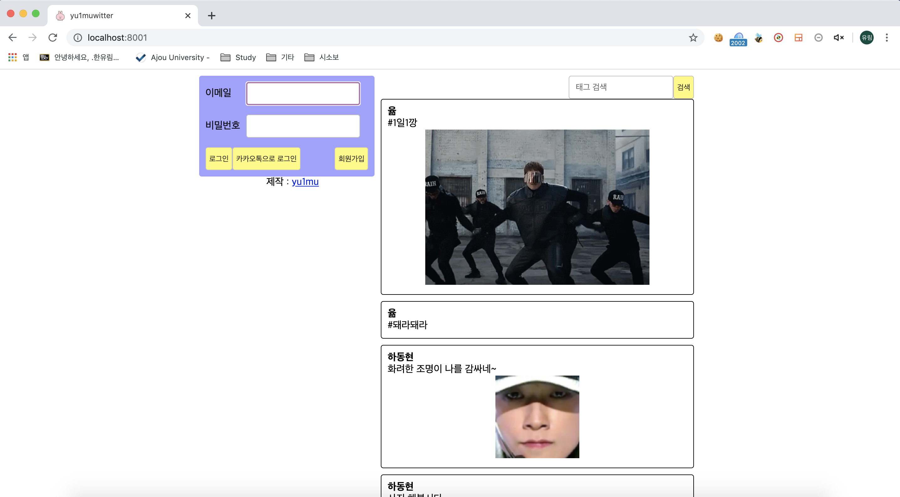
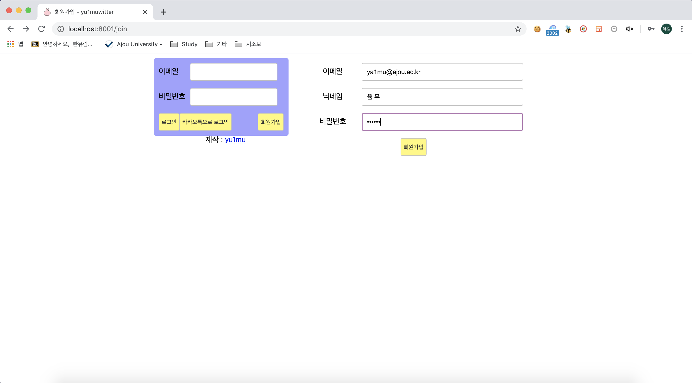
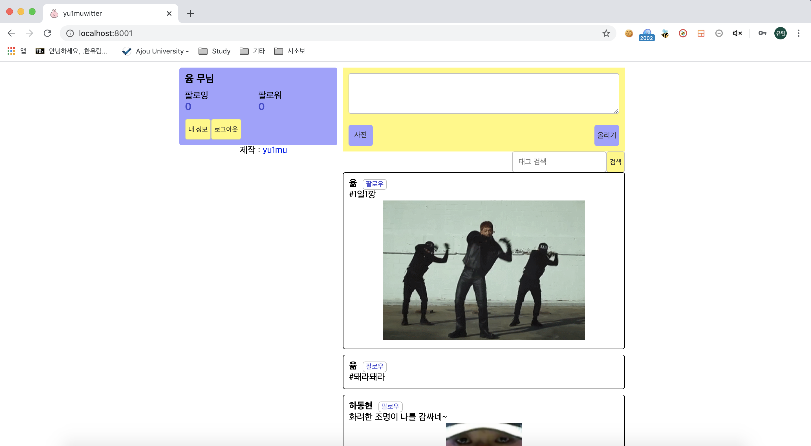
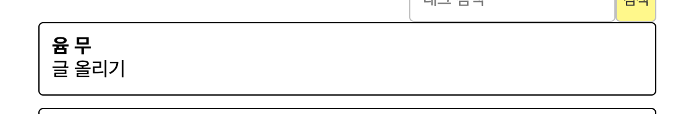
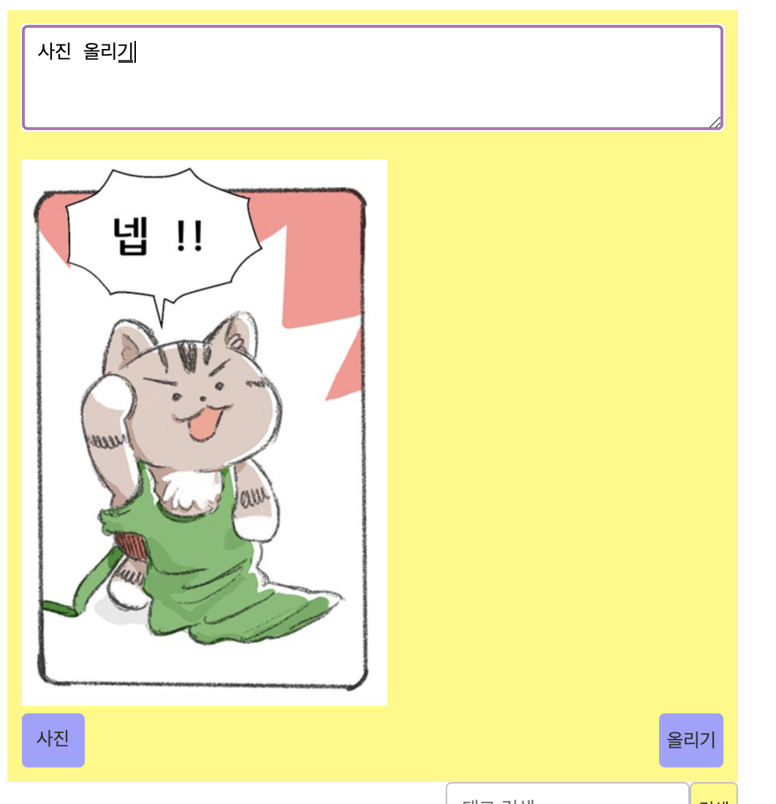
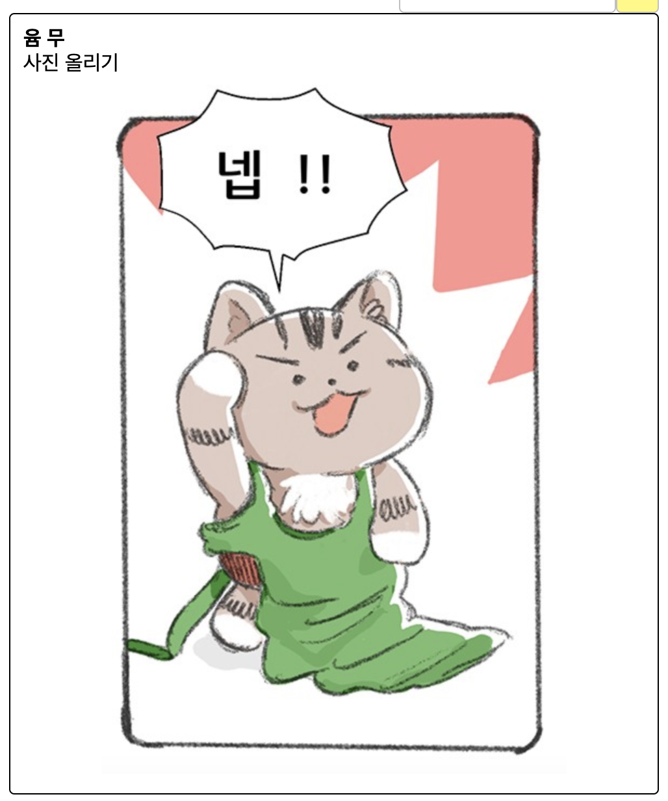
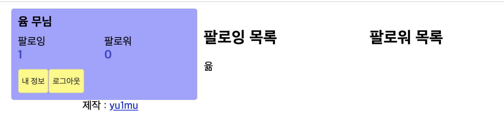
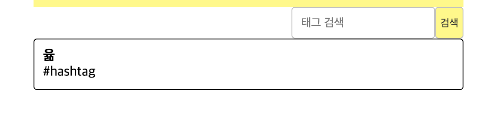

yu1muwitter
---
### 사용한 시스템
* Node.js, Express,
* DB : MySQL, Sequelize 기반
* 템플릿 엔진 : pug

### 사용 예시

> 홈 화면

> 회원가입 창 (카카오톡으로도 로그인 가능)

> 로그인 후 뜨는 화면

> 글을 올렸을 때 타임라인

> 올릴 사진을 선택하면 미리보기가 뜸.

> 사진을 올렸을 때 타임라인

> '윰 무' 계정으로 '윪' 계정을 팔로우했을 때 내 정보 창

> '윪' 계정의 정보 창

> 해시태그를 쓰면 태그 검색창에 검색할 시 해시태그별로 게시물을 볼 수 있음.

### 앞으로 더 구현해야 할 것들
* 팔로우 취소
* 프로필 정보 변경
* 게시글 좋아요, 취소
* 게시글 삭제